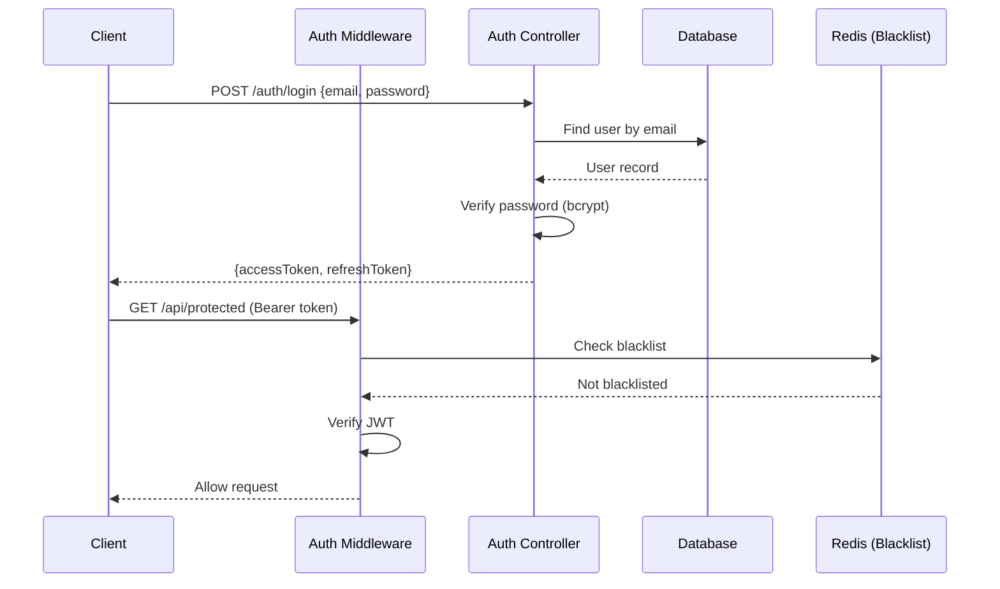
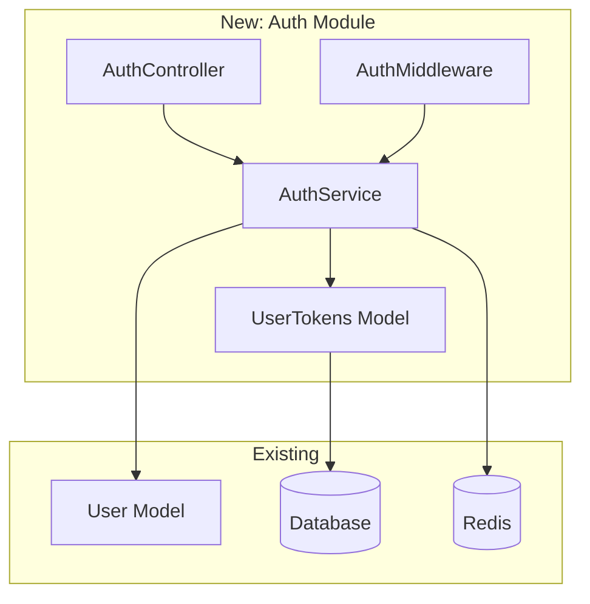

# User Authentication System - Branch Changelog

<!--
GUIDANCE: Title should be descriptive PR title, not branch name.
Good: "User Authentication System"
Bad: "feat/user-authentication"
-->

*Generated: 2026-01-15 | Branch: `feat/user-authentication` → `main`*

---

## Executive Summary

<!--
GUIDANCE: 2-3 sentences answering:
1. WHAT does this PR do?
2. WHY is it important?
3. WHAT is the impact?

Keep it high-level for stakeholders who won't read the whole document.
-->

This PR implements **JWT-based user authentication** with login, logout, and token refresh endpoints. Adds middleware for protected routes, password hashing with bcrypt, and comprehensive test coverage. Resolves security audit finding #142.

---

## Statistics

<!--
GUIDANCE: Auto-generated from git commands:
- git diff --stat | tail -1
- git log --oneline | wc -l
- Count test files in diff
-->

| Metric | Value |
|--------|-------|
| Files Changed | 18 |
| Lines Added | +1,247 |
| Lines Removed | -89 |
| Commits | 12 |
| New Tests | 24 |
| Issues Resolved | #142, #156 |

---

## Commit History

<!--
GUIDANCE: Extract from: git log TARGET..HEAD --oneline
Group by date if PR spans multiple days.
Type = conventional commit prefix (feat, fix, refactor, docs, test, chore)
-->

| Hash | Date | Type | Description |
|------|------|------|-------------|
| `a1b2c3d` | 2026-01-15 | docs | add API documentation for auth endpoints |
| `e4f5g6h` | 2026-01-15 | test | add integration tests for token refresh |
| `i7j8k9l` | 2026-01-14 | fix | handle expired token edge case |
| `m0n1o2p` | 2026-01-14 | refactor | extract token validation to middleware |
| `q3r4s5t` | 2026-01-14 | feat | add token refresh endpoint |
| `u6v7w8x` | 2026-01-13 | feat | add logout endpoint with token blacklist |
| `y9z0a1b` | 2026-01-13 | feat | add login endpoint with JWT generation |
| `c2d3e4f` | 2026-01-12 | feat | add User model with password hashing |
| `g5h6i7j` | 2026-01-12 | feat | add auth middleware for protected routes |
| `k8l9m0n` | 2026-01-12 | chore | add bcrypt and jsonwebtoken dependencies |
| `o1p2q3r` | 2026-01-11 | docs | add auth system design document |
| `s4t5u6v` | 2026-01-11 | feat | initial auth module structure |

---

## Architecture Changes

<!--
GUIDANCE: Include this section when:
- New modules/packages added
- Dependency relationships changed
- Data flow modified
- New external services integrated

Use Mermaid diagrams to visualize:
- flowchart: for component relationships
- sequenceDiagram: for request/response flows
- classDiagram: for data model changes
-->

### Authentication Flow

**Before:** No authentication — all endpoints public.

**After:** JWT-based auth with middleware protection.



### Module Structure



---

## File-by-File Analysis

<!--
GUIDANCE: Group by directory/module.
Focus on SIGNIFICANT changes — skip trivial ones.
Include:
- What changed (facts)
- Why it changed (reasoning)
- Impact (consequences)
-->

### `src/auth/` (NEW MODULE)

#### `src/auth/auth.controller.ts`

| Aspect | Details |
|--------|---------|
| **Added** | Login, logout, refresh endpoints |
| **Why** | Core authentication API surface |
| **Impact** | 3 new REST endpoints available |

#### `src/auth/auth.service.ts`

| Aspect | Details |
|--------|---------|
| **Added** | JWT generation, validation, password verification |
| **Why** | Business logic separation from controller |
| **Impact** | Reusable auth logic for future OAuth integration |

#### `src/auth/auth.middleware.ts`

| Aspect | Details |
|--------|---------|
| **Added** | Token extraction, validation, user injection |
| **Why** | Protect routes without code duplication |
| **Impact** | Any route can be protected with `@UseAuth()` decorator |

### `src/models/` (MODIFIED)

#### `src/models/user.model.ts`

| Aspect | Details |
|--------|---------|
| **Changed** | Added `passwordHash` field, removed plain `password` |
| **Why** | Security — never store plain passwords |
| **Impact** | Migration required for existing users |

---

## Bug Fixes

<!--
GUIDANCE: Include for each fix: commit.
Structure:
- Symptom: What user/system experienced
- Root Cause: Technical reason
- Solution: What was done
- Verification: How to confirm fix works
-->

### Token Expiry Edge Case

| Property | Value |
|----------|-------|
| **Commit** | `i7j8k9l` |
| **File(s)** | `src/auth/auth.middleware.ts` |
| **Symptom** | 500 error when token expires mid-request |
| **Root Cause** | JWT verify throws on expired token, unhandled exception |
| **Solution** | Wrap in try-catch, return 401 with `TOKEN_EXPIRED` code |
| **Verification** | `npm test -- --grep "expired token"` |

```typescript
// Before (bug)
const payload = jwt.verify(token, SECRET);

// After (fix)
try {
  const payload = jwt.verify(token, SECRET);
} catch (err) {
  if (err.name === 'TokenExpiredError') {
    throw new UnauthorizedError('TOKEN_EXPIRED');
  }
  throw new UnauthorizedError('INVALID_TOKEN');
}
```

---

## New Features

<!--
GUIDANCE: Include for each feat: commit.
Show:
- What it does (description)
- How to use it (example)
- Where it lives (files)
-->

### JWT Authentication

**Description:** Complete auth system with login, logout, and token refresh.

**Endpoints:**

| Method | Path | Description |
|--------|------|-------------|
| POST | `/auth/login` | Authenticate user, return tokens |
| POST | `/auth/logout` | Invalidate current token |
| POST | `/auth/refresh` | Get new access token |

**Usage:**

```bash
# Login
curl -X POST /auth/login \
  -H "Content-Type: application/json" \
  -d '{"email": "user@example.com", "password": "secret"}'

# Response: {"accessToken": "...", "refreshToken": "..."}

# Access protected route
curl -X GET /api/users/me \
  -H "Authorization: Bearer <accessToken>"
```

**Files:** `src/auth/auth.controller.ts`, `src/auth/auth.service.ts`

### Protected Route Middleware

**Description:** Decorator to require authentication on any route.

**Usage:**

```typescript
@Controller('users')
export class UsersController {
  @Get('me')
  @UseAuth()  // <-- Requires valid JWT
  getProfile(@CurrentUser() user: User) {
    return user;
  }
}
```

**Files:** `src/auth/auth.middleware.ts`, `src/decorators/auth.decorator.ts`

---

## Breaking Changes

<!--
GUIDANCE: Include when:
- Public API changed
- Database schema changed
- Configuration format changed
- Behavior changed in incompatible way

Always provide migration path!
-->

| Change | Impact | Migration |
|--------|--------|-----------|
| User.password → User.passwordHash | Existing users can't login | Run migration script (see below) |
| /api/* routes now require auth | Unauthenticated requests fail | Add Bearer token to requests |

### Migration Script

```bash
# Migrate existing users (one-time)
npm run migrate:hash-passwords

# This will:
# 1. Read all users with plain passwords
# 2. Hash with bcrypt (cost=12)
# 3. Update passwordHash field
# 4. Remove password field
```

---

## Related Issues

<!--
GUIDANCE:
- Resolved: Issues closed by this PR
- Created: New issues discovered during development
-->

### Resolved

| Issue | Title | Status |
|-------|-------|--------|
| #142 | Security: Implement user authentication | ✅ Resolved |
| #156 | Add token refresh mechanism | ✅ Resolved |

### Created (Follow-up Work)

| Issue | Title | Type |
|-------|-------|------|
| #189 | Add OAuth2 provider support | enhancement |
| #190 | Implement rate limiting for auth endpoints | security |
| #191 | Add 2FA support | enhancement |

---

## Test Coverage

<!--
GUIDANCE: List test files added/modified.
Include command to run tests.
-->

| Test File | Tests | Coverage |
|-----------|-------|----------|
| `auth.controller.spec.ts` | 8 | Login, logout, refresh flows |
| `auth.service.spec.ts` | 10 | Token generation, validation |
| `auth.middleware.spec.ts` | 6 | Protected routes, edge cases |

**Run tests:**

```bash
# All auth tests
npm test -- --grep "Auth"

# With coverage
npm run test:cov -- src/auth/
```

---

## Migration Notes

<!--
GUIDANCE: Include when post-merge action required.
Be specific and actionable.
-->

### After Merge

1. **Run database migration:**
   ```bash
   npm run db:migrate
   ```

2. **Hash existing passwords:**
   ```bash
   npm run migrate:hash-passwords
   ```

3. **Add environment variables:**
   ```bash
   JWT_SECRET=<generate-secure-secret>
   JWT_EXPIRES_IN=15m
   REFRESH_TOKEN_EXPIRES_IN=7d
   ```

4. **Update API clients** to include Authorization header

### Configuration Changes

Add to `.env`:

```env
# JWT Configuration
JWT_SECRET=your-256-bit-secret
JWT_EXPIRES_IN=15m
REFRESH_TOKEN_EXPIRES_IN=7d

# Redis for token blacklist
REDIS_URL=redis://localhost:6379
```

---

*Generated by `/changelog-before-merge` skill*
