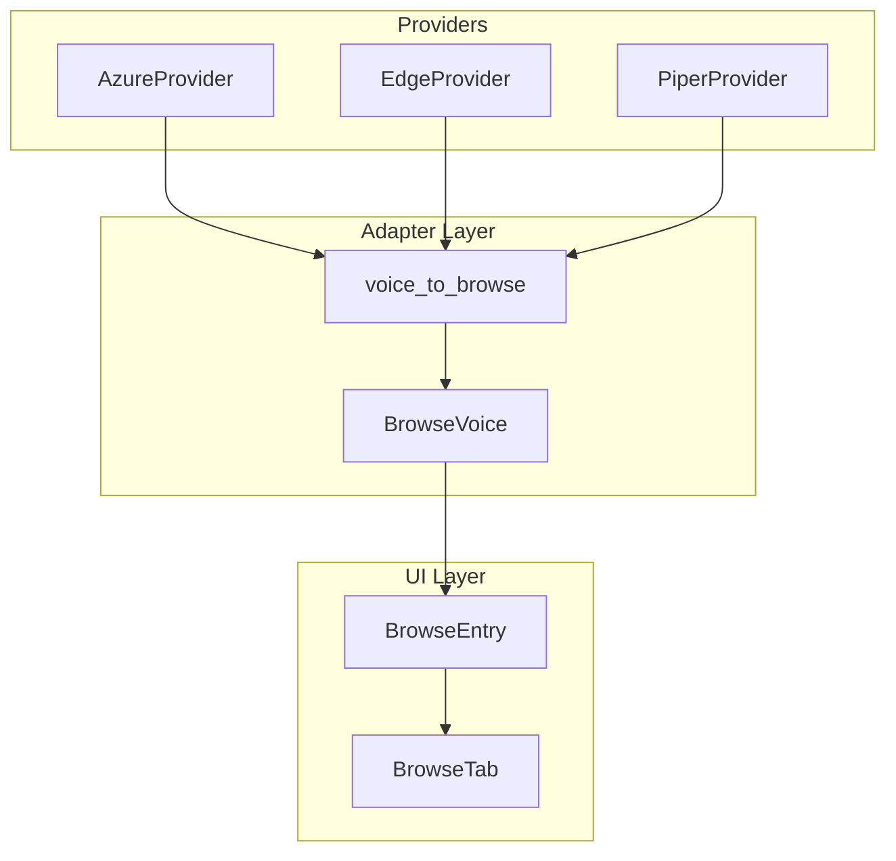

# Real-World Example: jaine-speech PR #44

<!--
This is a REAL changelog generated for an actual PR.
Shows how the skill output looks in production.
Project: jaine-speech (TTS toolkit)
PR: Provider Onboarding Wizard
-->

*Generated: 2026-01-23 | Branch: `feat/provider-onboarding-wizard` → `jaine-speech/main`*

---

## Executive Summary

This PR implements a **Provider Onboarding Wizard** — a 6-stage interactive workflow for integrating new TTS providers. Created multi-provider architecture using adapter pattern, fixed **11 bugs** in TUI components, and added **62+ tests** for comprehensive coverage.

---

## Statistics

| Metric | Value |
|--------|-------|
| Files Changed | 42 |
| Lines Added | +5,472 |
| Lines Removed | -149 |
| Commits | 24 |
| New Tests | 62+ |
| Issues Resolved | 3 |
| Issues Created | 3 |

---

## Commit History

| Hash | Date | Type | Description |
|------|------|------|-------------|
| `d866b17` | 2026-01-23 | docs | update changelog with latest commits |
| `79cef2a` | 2026-01-23 | fix | improve MP3 validation for mono frames |
| `31eb231` | 2026-01-23 | docs | add NOTE about SSML provider support |
| `b605c70` | 2026-01-23 | refactor | remove unused Ctrl+S binding |
| `6c5bec6` | 2026-01-23 | fix | load voice cache even if TTL expired |
| `32e788f` | 2026-01-23 | fix | restore provider_mode on startup |
| `0b75478` | 2026-01-23 | fix | Presets Tab grid layout |
| `e177b05` | 2026-01-23 | fix | escape provider badge brackets |
| `a672bf7` | 2026-01-23 | feat | E2E tests for SPEC compliance |
| `ca6089f` | 2026-01-23 | fix | validate style before setting Select |
| `4d35fc0` | 2026-01-22 | fix | RadioSet multiple selection bug |
| `7fee319` | 2026-01-22 | feat | add provider badge to voice display |
| `ec91376` | 2026-01-22 | feat | implement Provider Onboarding Wizard |
| `810947e` | 2026-01-22 | docs | add Provider Onboarding specification |

---

## Architecture Changes

### Multi-Provider Adapter Pattern

**Problem:** Browse tab only supported one provider type with hardcoded fields.

**Solution:** Adapter pattern with unified `BrowseVoice` model.



**Impact:** Any new provider automatically appears in Browse tab after implementing `voice_to_browse()` method.

---

## Bug Fixes

### Rich Markup Escaping

| Property | Value |
|----------|-------|
| **Symptom** | Provider badge `[AZ]` disappears from display |
| **Root Cause** | Rich/Textual interprets `[]` as markup tags |
| **Solution** | Escape brackets: `\[AZ]` |

```python
# Before (bug)
label.update("[AZ] Voice Name")  # Renders: "Voice Name"

# After (fix)
label.update("\\[AZ] Voice Name")  # Renders: "[AZ] Voice Name"
```

### Provider Mode Not Persisting

| Property | Value |
|----------|-------|
| **Symptom** | Pronunciation mode resets on app restart |
| **Root Cause** | RadioSet.Changed event fires on programmatic selection, overwriting saved value |
| **Solution** | Set `_pending_provider_mode` before RadioButton creation |

### Style Dropdown Crash

| Property | Value |
|----------|-------|
| **Symptom** | App crashes when setting invalid style |
| **Root Cause** | Textual raises `InvalidSelectValueError`, not `ValueError` |
| **Solution** | Catch both exception types |

---

## New Features

### Provider Onboarding Wizard

**6-stage workflow for adding new TTS providers:**

| Stage | Purpose |
|-------|---------|
| 1 | Backend classification (HTTP/Library/Process) |
| 2 | Class implementation from template |
| 3 | Health check & voice enumeration |
| 4 | Registry integration verification |
| 5 | UI integration testing |
| 6 | Documentation update |

### Multi-Provider Browse Tab

Browse tab now loads voices from all healthy providers simultaneously.

### Provider Badge

Voice display shows provider indicator: `[AZ]` Azure, `[ED]` Edge, `[PI]` Piper.

---

## Breaking Changes

| Change | Impact | Migration |
|--------|--------|-----------|
| `LangDetector.LINGUA` removed | None — was dead code | No action needed |
| `lang_detector` field removed | Old configs still work | Field ignored on load |

---

## Related Issues

### Resolved
- Provider Onboarding Wizard — ✅ Implemented
- SSML provider support — ✅ NOTE added

### Created (Follow-up)
- OUTPUT format dropdown broken — bug
- Persist more UI state — feature
- Edge/Piper show Azure modes — bug

---

## Migration Notes

1. **Voice Cache:** Clear `data/voice_cache.json` if parsing issues occur
2. **Old Configs:** `lang_detector` field is now ignored (backward compatible)
3. **tts-server-go:** Ensure API returns camelCase field names

---

*Generated by `/changelog-before-merge` skill — Real-world example from jaine-speech project*
