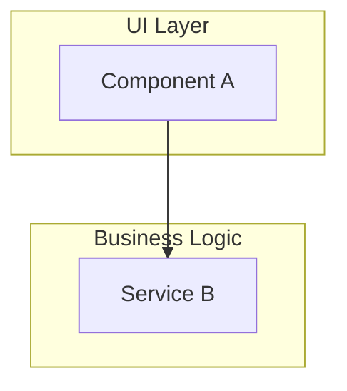
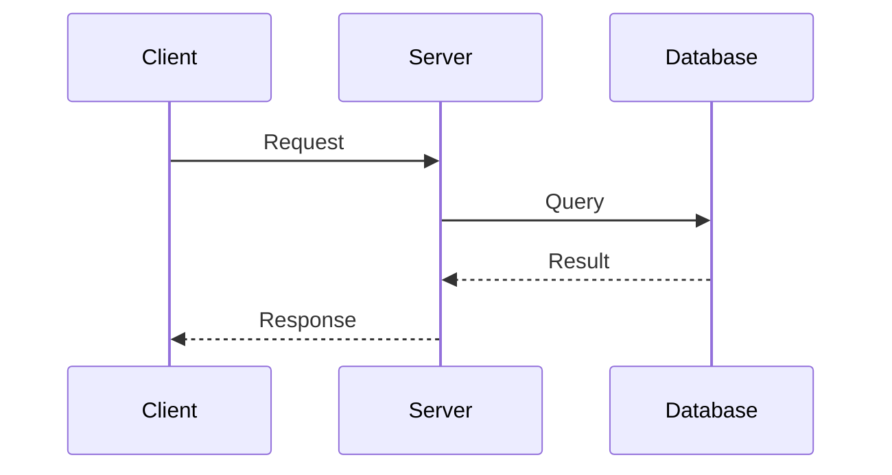
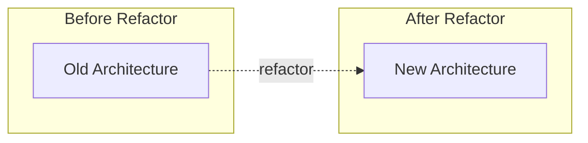
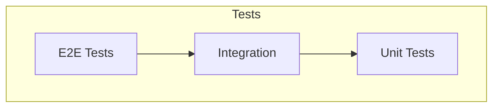
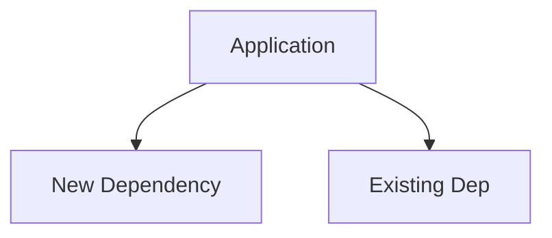

# Mermaid Diagrams Requirements

## Diagram Count by PR Size

| PR Size | Minimum Diagrams |
|---------|------------------|
| 1-10 files | 1 (architecture) |
| 11-30 files | 3 (arch + flow + tests) |
| 31+ files | 5 (full set) |

---

## Required Diagram Types

### 1. Component Architecture (REQUIRED)

Shows module relationships and layers.



### 2. Data/Request Flow (REQUIRED for features)

Sequence diagram showing request flow.



### 3. State Changes (REQUIRED for refactors)

Before/After comparison.



### 4. Test Coverage Map (REQUIRED)

Test file hierarchy.



### 5. Dependency Graph (if new deps added)

New dependencies visualization.



---

## Depth-Level Requirements

### Standard Depth
- 1-3 diagrams
- Focus on architecture and data flow
- Basic test coverage map if tests added

### Thorough Depth (`--depth thorough`)
- 5+ diagrams
- All diagram types
- Detailed before/after for refactors
- Full dependency graph
- Security-relevant flows if sensitive files

---

## Mermaid Syntax Tips

**Subgraphs for grouping:**
```mermaid
subgraph GroupName["Display Label"]
    Node1[Content]
    Node2[Content]
end
```

**Arrow types:**
- `-->` solid arrow
- `-.->` dotted arrow
- `==>` thick arrow
- `-->>` async/message arrow

**Node shapes:**
- `[Text]` rectangle
- `(Text)` rounded
- `{Text}` diamond
- `[(Text)]` cylinder (database)

**Styling:**
```mermaid
style NodeId fill:#f9f,stroke:#333
```
